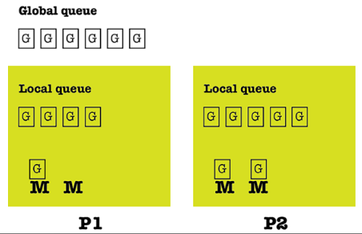

# The Go scheduler

The OS kernel scheduler is responsible for the execution of the threads of a program. Similarly, the Go runtime has its own scheduler, which is responsible for the execution of the goroutines using a technique known as __m:n scheduling__, where m goroutines are executed using n OS threads using multiplexing. The Go scheduler is the Go component responsible for the way and the order in which the goroutines of a Go program get executed. The Go scheduler is executed as a goroutine.

Go uses the __fork-join concurrency__ model. The fork part of the model, which should not be confused with the fork(2) system call, states that a child branch can be created at any point of a program. Analogously, the join part of the Go concurrency model is where the child branch ends and joins with its parent. Keep in mind that both sync.Wait() statements and channels that collect the results of goroutines are join points, whereas each new goroutine creates a child branch.

The __fair scheduling strategy__, which is pretty straightforward and has a simple implementation, shares all load evenly among the available processors. At first, this might look like the perfect strategy because it does not have to take many things into consideration while keeping all processors equally occupied. However, it turns out that this is not exactly the case because most distributed tasks usually depend on other tasks. Therefore, some processors are underutilized, or equivalently, some processors are utilized more than others. A goroutine is a task, whereas everything after the calling statement of a goroutine is a continuation. In the work-stealing strategy used by the Go scheduler, a (logical) processor that is underutilized looks for additional work from other processors.

When it finds such jobs, it steals them from the other processor or processors, hence the name. Additionally, the work-stealing algorithm of Go queues and steals continuations. A stalling join, as is suggested by its name, is a point where a thread of execution stalls at a join and starts looking for other work to do. Although both task stealing and continuation stealing have stalling joins, continuations happen more often than tasks; therefore, the Go scheduling algorithm works with continuations rather than tasks.

The main disadvantage of continuation stealing is that it requires extra work from the compiler of the programming language. Fortunately, Go provides that extra help and therefore uses continuation stealing in its work-stealing algorithm. One of the benefits of continuation stealing is that you get the same results when using function calls instead of goroutines or a single thread with multiple goroutines. This makes perfect sense, as only one thing is executed at any given point in both cases.

The Go scheduler works using three main kinds of entities: OS threads (M), which are related to the OS in use; goroutines (G); and logical processors (P). The number of processors that can be used by a Go program is specified by the value of the GOMAXPROCS environment variable—at any given time, there are at most GOMAXPROCS processors. Now, let us return to the m:n scheduling algorithm used in Go. Strictly speaking, at any time, you have m goroutines that are executed, and therefore scheduled to run, on n OS threads using, at most, GOMAXPROCS number of logical processors. You will learn more about GOMAXPROCS shortly.

    
</img>
